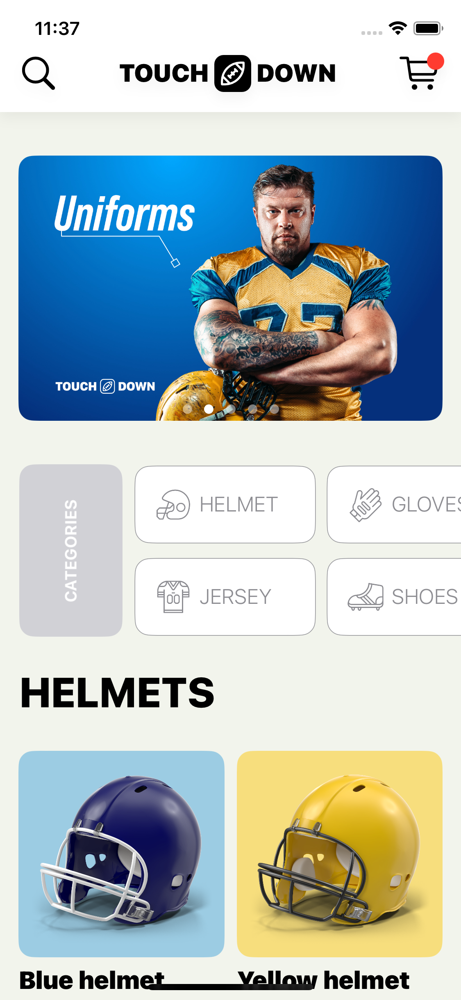
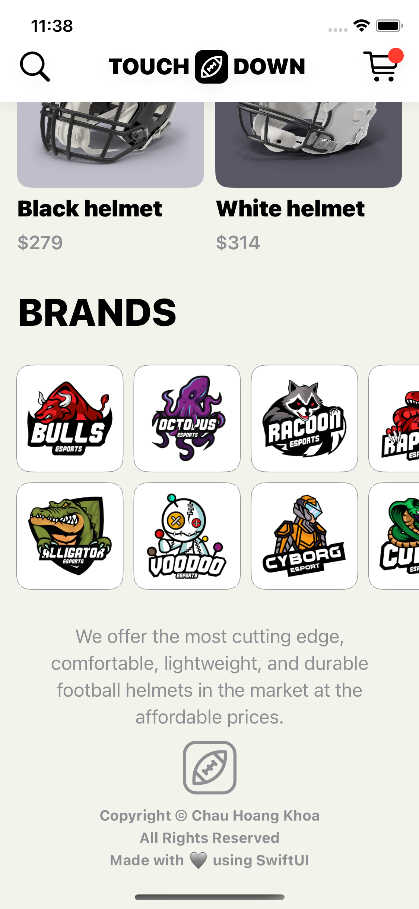
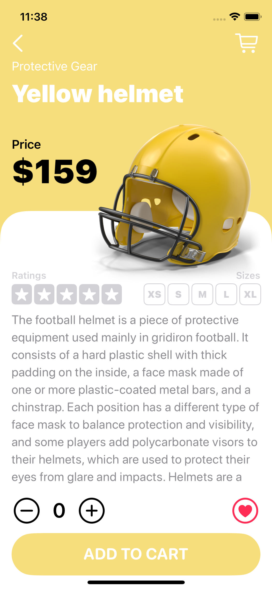
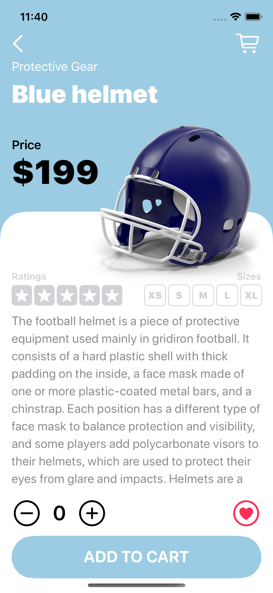

### Project: E-Commerce Shopping App

**Description:**
Create an e-commerce shopping app that allows users to browse products, add them to a cart, and make purchases. The app will feature product recommendations, user reviews, and order tracking.

**Key Features:**
1. @EnvironmentObject property wrapper
1. @ObservableObject property wrapper
1. Custom navigation bar
1. Custom shape with Path
1. PageTab View
1. GridLayouts
1. JSON decoding and fetching data
1. Adaptative layout design
1. Xcodegen for dependency and project management

**Screenshots:**

